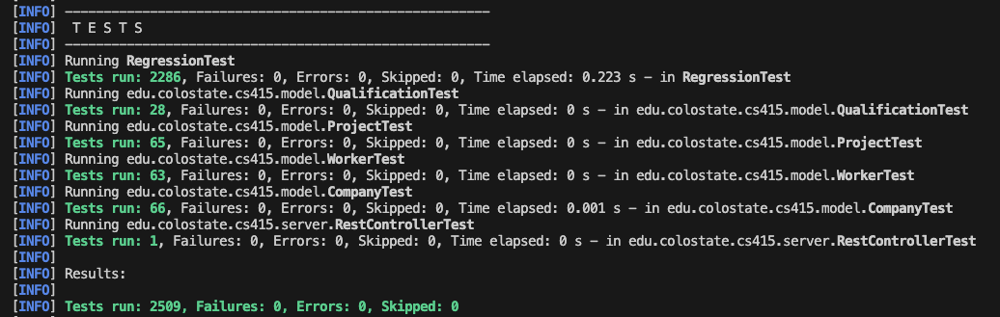
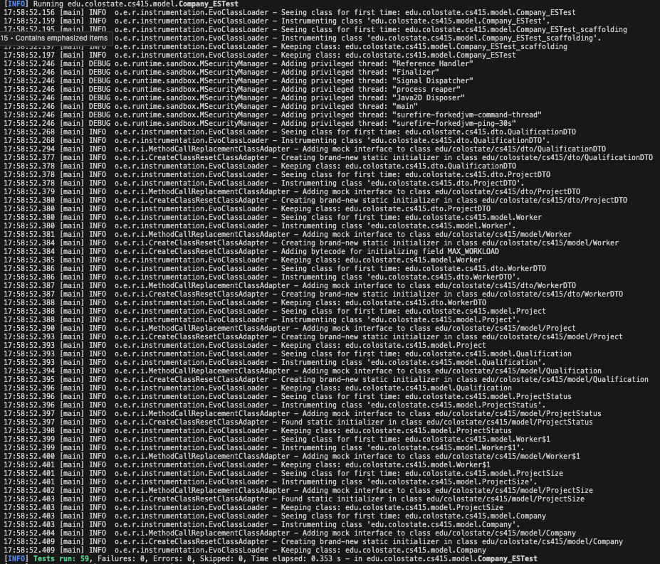
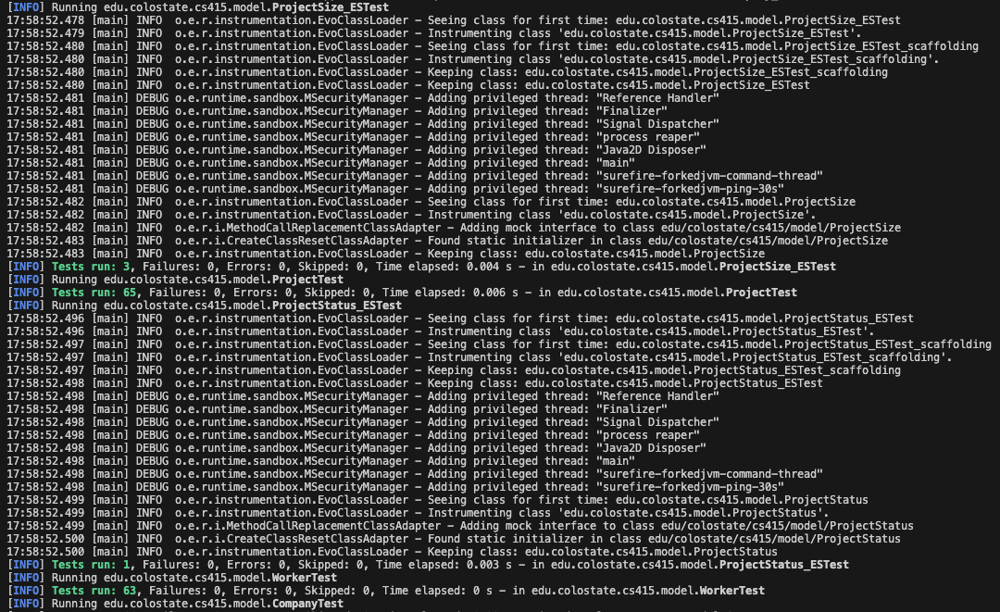
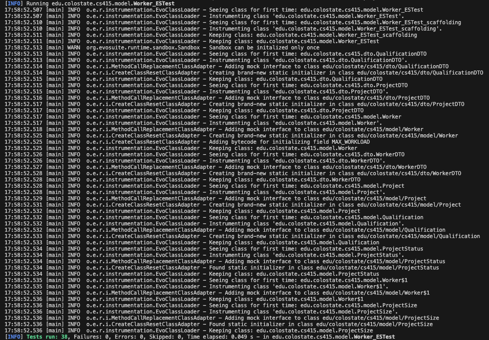
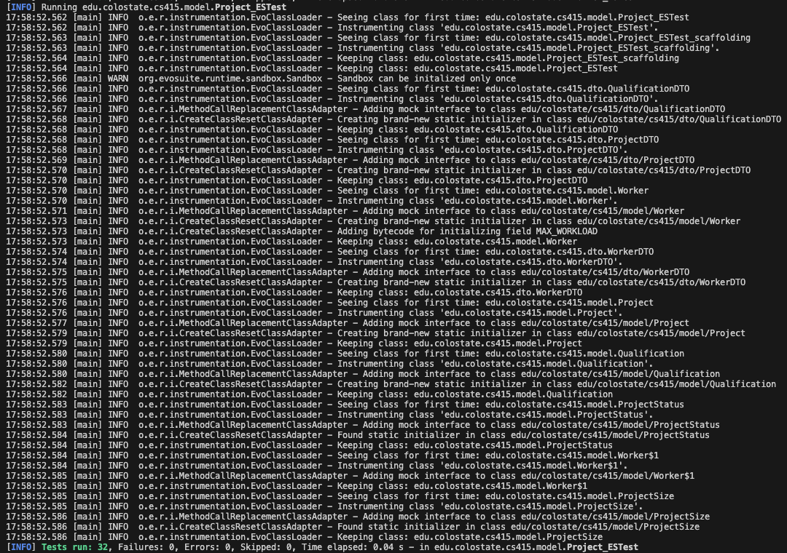
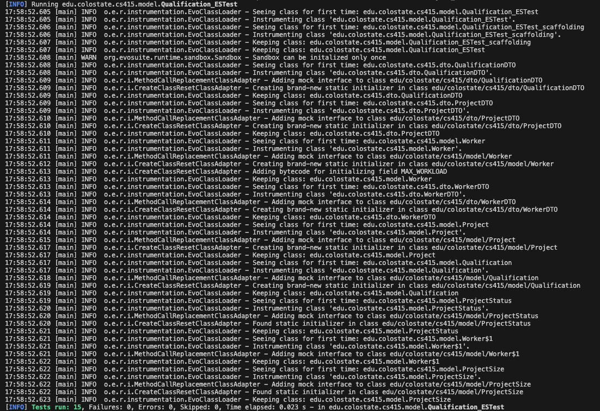

# Automatic Test Generation

## Randoop

### Command Used
```bash
java -cp "tools/randoop-all-4.3.2.jar:target/classes" randoop.main.Main gentests --classlist=tools/classes.txt --time-limit=60
```
### Generated Tests
- `RegressionTest.java`
- `RegressionTest0.java`
- `RegressionTest1.java`
- `RegressionTest2.java`
- `RegressionTest3.java`
### Verification
Command used:
```bash
mvn test
```


##
## Evosuite

### Command Used
```bash
java -jar tools/evosuite-1.0.6.jar -prefix edu.colostate.cs415.model -projectCP target/classes
```

### Generated tests

- `Company_ESTest.java`
- `Company_ESTest_scaffolding.java`
- `Project_ESTest.java`
- `Project_ESTest_scaffolding.java`
- `Qualification_ESTest.java`
- `Qualification_ESTest_scaffolding.java`
- `Worker_ESTest.java`
- `Worker_ESTest_scaffolding.java`
- `ProjectSize_ESTest.java`
- `ProjectSize_ESTest_scaffolding.java`
- `ProjectStatus_ESTest.java`
- `ProjectStatus_ESTest_scaffolding.java`

### Verification
Command used:
```bash
mvn test
```
- `Company_ESTest.java` Tests run: 59, Failures: 0, Errors: 0, Skipped: 0, Time elapsed: 0.303 s
- `Project_ESTest.java` Tests run: 3, Failures: 0, Errors: 0, Skipped: 0, Time elapsed: 0.004 s
- `Qualification_ESTest.java` Tests run: 15, Failures: 0, Errors: 0, Skipped: 0, Time elapsed: 0.016 s
- `Worker_ESTest.java` Tests run: 38, Failures: 0, Errors: 0, Skipped: 0, Time elapsed: 0.046 s
- `ProjectSize_ESTest.java` Tests run: 3, Failures: 0, Errors: 0, Skipped: 0, Time elapsed: 0.004 s
- `ProjectStatus_ESTest.java` Tests run: 1, Failures: 0, Errors: 0, Skipped: 0, Time elapsed: 0.002 s

screenshot:







###