# PMD Report

**Last Published:** 2026-03-25  
**Version:** 1.0-SNAPSHOT  
**Built by:** Maven  

---

## Overview
The following screenshots show the results generated by PMD in target/site/pmd.xml after running:

mvn pmd:pmd pmd:cpd

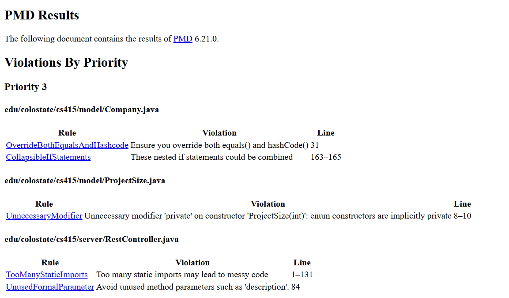
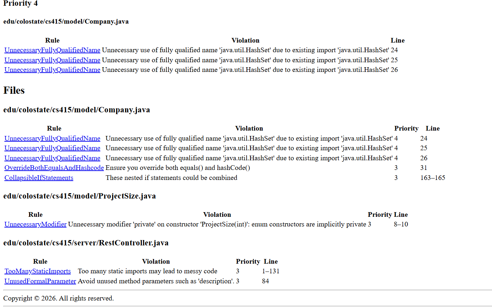
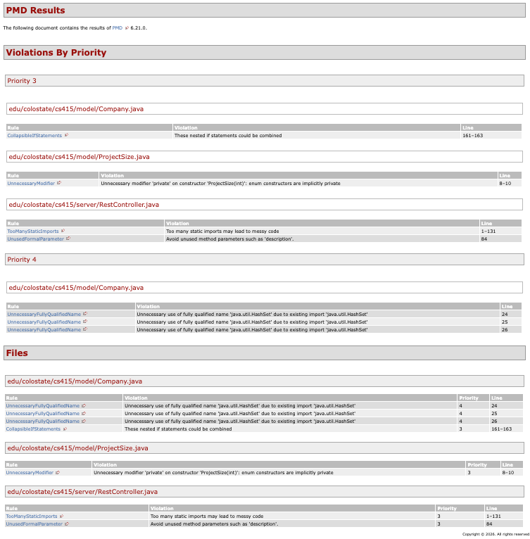
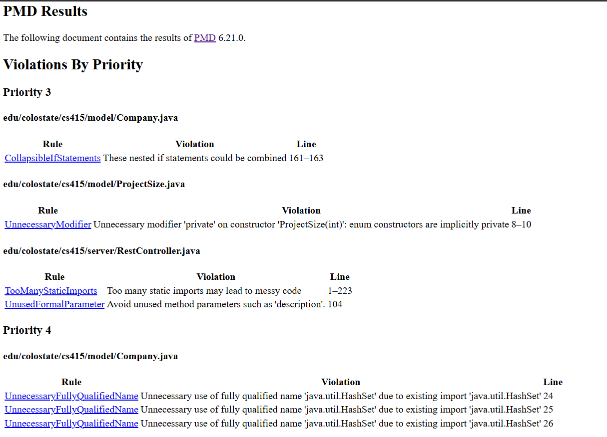
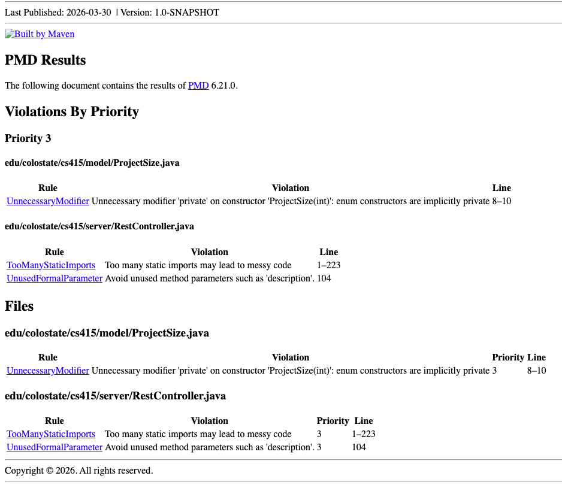
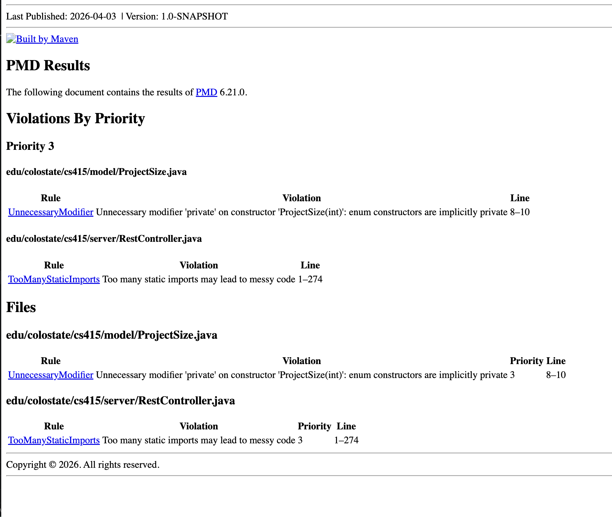

## Fixed all PMD issues in our written code, excluding the provided classes.

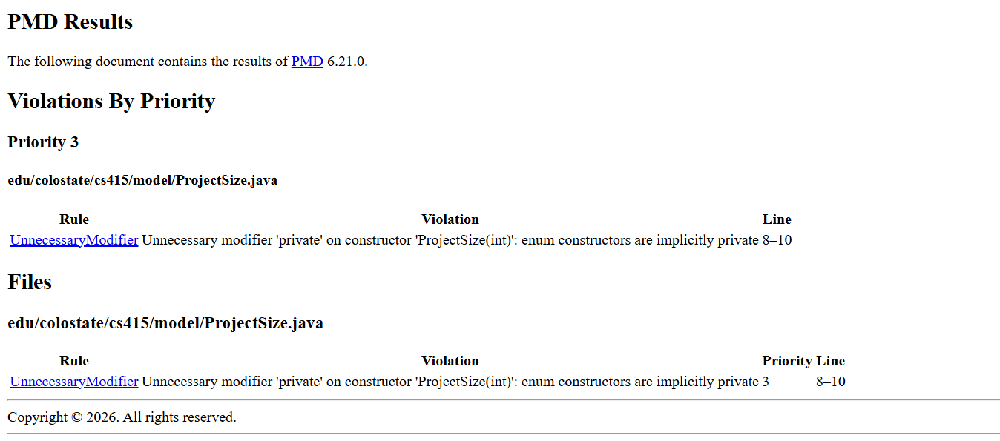

# SpotBugs Report

## Overview
The following screenshots show the results generated by SpotBugs in spotbugs.xml after running:

mvn spotbugs:spotbugs

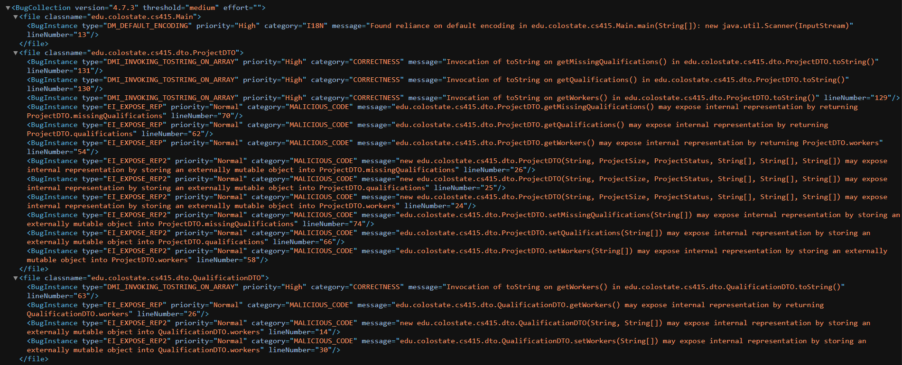
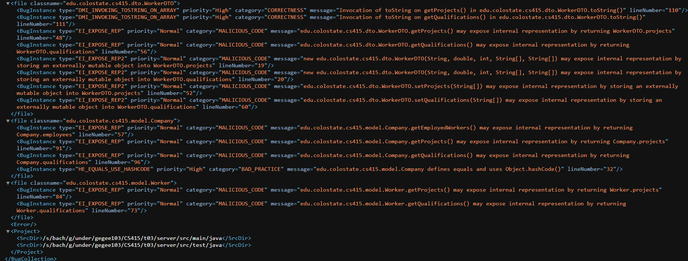
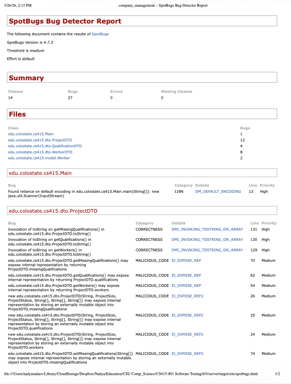
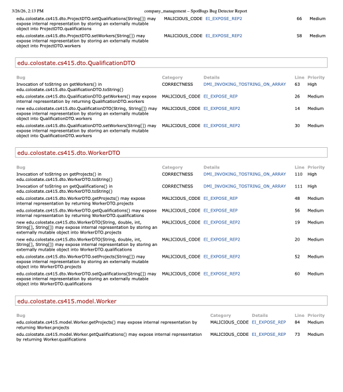

## Fixed all SpotBugs issues in our written code, excluding the provided classes.
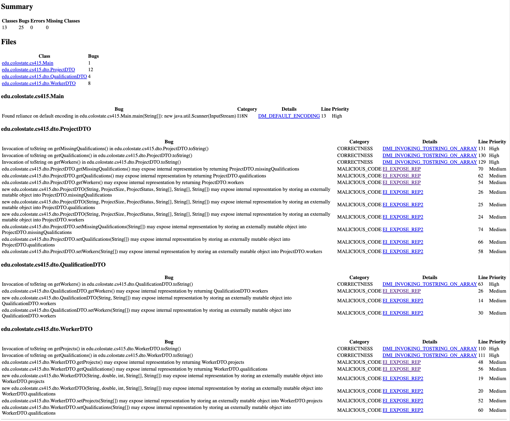